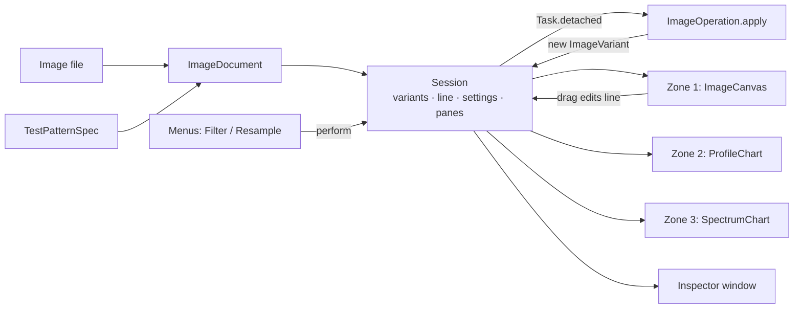
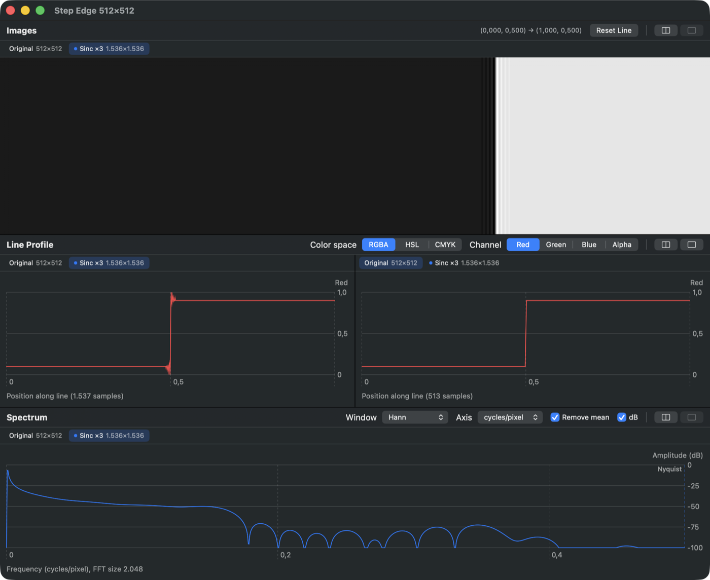

# LineScope: theory and code

LineScope is a macOS tool for *seeing* what resampling and filtering do to an image. You derive copies of an image with different methods and draw one line across them. For every copy the app shows, side by side:

1. **Zone 1:** the image at its true pixel scale, with the line drawn on it.
2. **Zone 2:** the *profile*, one color channel sampled along the line.
3. **Zone 3:** the *spectrum*, the Fourier transform of that profile.

This document explains the signal-processing theory behind each of those views, then shows where and how the code implements it. The companion book in [`../LiterateP`](../LiterateP) (`make pdf`) walks through every line of code. This document is about the ideas and how they fit together.

**Contents**

1. [Images as samples](#1-images-as-samples)
2. [Sampling, Nyquist and aliasing](#2-sampling-nyquist-and-aliasing)
3. [Resampling](#3-resampling)
4. [Filtering](#4-filtering)
5. [Profiles along a line](#5-profiles-along-a-line)
6. [Color models](#6-color-models)
7. [The spectrum](#7-the-spectrum)
8. [Test patterns](#8-test-patterns)
9. [Application architecture](#9-application-architecture)
10. [Experiments](#10-experiments)
11. [Limitations and possible extensions](#11-limitations-and-possible-extensions)
12. [Verification](#12-verification)
13. [References](#13-references)

---

## 1. Images as samples

### Theory

A digital image is a grid of **samples** of a continuous light distribution $I(x, y)$. The code uses the *pixel-center* convention: pixel $j$ covers the interval $[j, j+1)$ and represents the value at its center,

$$p_j = I\left(j + \tfrac12\right).$$

Every other formula in the program (resampling, line sampling, pattern generation) uses the same convention. That consistency keeps the copies aligned: a copy scaled by $s$ has the same *continuous* extent, and its pixel centers sit at $(i + \tfrac12)/s$ in source coordinates.

Two properties of the stored numbers matter:

* **Encoding.** Image files store sRGB-*encoded* values $V \in [0,1]$, which relate to linear light roughly as $L \approx V^{2.2}$. LineScope processes the encoded values directly, so the numbers in the profile are the numbers you see on screen. Section 11 discusses what that means.
* **Alpha.** Transparency is stored *straight*, as $(r, g, b, a)$. Averaging straight colors leaks the color of invisible pixels into their neighbors. Anything that averages pixels therefore first converts to **premultiplied** form $(ar, ag, ab, a)$, averages, and divides by $a$ at the end.

### Code

* [`PixelBuffer`](../Packages/LineScopeCore/Sources/LineScopeCore/PixelBuffer.swift) is the single working format: interleaved RGBA `Float32`, row 0 at the top, straight alpha, sRGB-encoded.
* [`init?(cgImage:)`](../Packages/LineScopeCore/Sources/LineScopeCore/PixelBuffer.swift#L96) decodes any image by drawing it into an 8-bit sRGB bitmap context. Core Graphics then performs color conversion from the file's profile. The result is unpremultiplied into floats.
* [`makeCGImage()`](../Packages/LineScopeCore/Sources/LineScopeCore/PixelBuffer.swift#L117) goes the other way for display and PNG export.
* [`premultiplied()`](../Packages/LineScopeCore/Sources/LineScopeCore/PixelBuffer.swift#L60) and [`fromPremultiplied`](../Packages/LineScopeCore/Sources/LineScopeCore/PixelBuffer.swift#L71) implement the alpha round trip. The latter also **clamps** to $[0,1]$, which matters for sharpening filters that overshoot (§10.4).

---

## 2. Sampling, Nyquist and aliasing

### Theory

Sampling once per pixel can only represent frequencies up to the **Nyquist frequency**

$$f_N = \tfrac12 \ \text{cycle per pixel}.$$

A component at frequency $f > f_N$ doesn't disappear. It is indistinguishable, at the sample points, from a component at the *alias* frequency

$$f_a = \lvert f - n \rvert, \qquad n = \operatorname{round}(f).$$

The figure shows the classic case. A cosine at 0.8 cycles/pixel and one at 0.2 cycles/pixel agree at every integer position.

Aliasing is the reason resampling is hard. Shrinking an image by a factor $s < 1$ lowers the Nyquist frequency, in *source* pixels, to $s/2$. Any detail between $s/2$ and $1/2$ must be removed **before** sampling, or it folds back as false low-frequency structure: moiré, false rings, jagged edges. That removal is a low-pass **prefilter**.

### In the app

The spectrum zone draws a dashed **Nyquist** rule, and zone 3 can show two x-axes (§7):

* In **cycles/pixel**, each copy's Nyquist line sits at 0.5 of its own pixels.
* In **cycles/line**, frequencies are measured against the line itself, so the same image feature sits at the same x in every copy. A half-size copy's Nyquist line then sits at half the position of the original's, which makes folding easy to see.

---

## 3. Resampling

### 3.1 Reconstruction and prefiltering

Resampling means estimating the continuous image from its samples and sampling that estimate on a new grid. With a **reconstruction kernel** $k$:

$$\tilde I(x) = \sum_j p_j \, k\!\left(x - (j + \tfrac12)\right).$$

For a scale factor $s$ (output size = $s \times$ input size), output pixel $i$ is centered at source position $c_i = (i + \tfrac12)/s$.

When **enlarging** ($s \ge 1$), sampling $\tilde I$ at $c_i$ is enough.

When **shrinking** ($s < 1$), the kernel is also stretched by $\sigma = 1/s$. Stretching a kernel in space by $\sigma$ compresses its frequency response to $K(\sigma f)$, so the cutoff moves from $\tfrac12$ to $\tfrac{s}{2}$, exactly the new Nyquist frequency. Reconstruction and prefilter become one kernel. The combined rule, per axis, is

$$q_i = \frac{\sum_j p_j\, k\!\left(\dfrac{j + \frac12 - c_i}{\sigma}\right)}{\sum_j k\!\left(\dfrac{j + \frac12 - c_i}{\sigma}\right)}, \qquad \sigma = \max\!\left(1, \tfrac1s\right).$$

The denominator normalizes the weights to sum to 1. That keeps flat regions flat, even for kernels whose samples don't sum to one. It also defines the edge rule: near the border the weights that fall outside are dropped and the rest renormalized, rather than inventing pixels.

A 2-D image uses the **separable** kernel $k(x)\,k(y)$. The code resamples all rows first, then all columns. This costs $O(\text{taps})$ per pixel per pass instead of $O(\text{taps}^2)$.

### 3.2 The kernels

| Method | Kernel $k(x)$ | Support | Interpolating? | Character |
|---|---|---|---|---|
| **Nearest** | picks the pixel containing $c_i$ | – | yes | No prefilter: aliases when shrinking, blocky when enlarging |
| **Tent** (bilinear) | $\max(0,\ 1-\lvert x\rvert)$ | 1 | yes | Smooth and ring-free, but blurry |
| **Catmull-Rom** (bicubic) | BC-spline, $B=0,\ C=\tfrac12$ | 2 | yes | Sharp, slight ringing; reproduces quadratics exactly |
| **Mitchell-Netravali** | BC-spline, $B=C=\tfrac13$ | 2 | **no** ($k(0)=\tfrac89$) | A compromise between blur, ringing and anisotropy |
| **Lanczos-3** | $\operatorname{sinc}(x)\,\operatorname{sinc}(x/3)$, $\lvert x\rvert<3$ | 3 | yes | Very sharp, visible ringing at edges |
| **Sinc** (truncated) | $\operatorname{sinc}(x)$, $\lvert x\rvert<8$ | 8 | yes | Near-ideal low-pass cut off by a hard window: strong ringing |
| **Area** | exact footprint coverage | $\tfrac{1}{2s}$ | – | Box prefilter; good for integer reductions |

Here $\operatorname{sinc}(x) = \sin(\pi x)/(\pi x)$.

The two cubics come from one family, the Keys / Mitchell-Netravali **BC-splines**:

$$
k(x) = \frac16
\begin{cases}
(12 - 9B - 6C)\lvert x\rvert^3 + (-18 + 12B + 6C)\lvert x\rvert^2 + (6 - 2B), & \lvert x\rvert < 1,\\[2pt]
(-B - 6C)\lvert x\rvert^3 + (6B + 30C)\lvert x\rvert^2 + (-12B - 48C)\lvert x\rvert + (8B + 24C), & 1 \le \lvert x\rvert < 2,\\[2pt]
0, & \text{otherwise.}
\end{cases}
$$

$B$ controls blur and $C$ controls ringing. Mitchell and Netravali's user study found $B + 2C = 1$ the best line, and $(\tfrac13, \tfrac13)$ the best point on it. With $B \ne 0$ the kernel no longer passes through the samples, so Mitchell slightly smooths even at $\times 1$.

**Area** is different. Its weights are the overlap lengths between each source pixel $[j, j+1)$ and the output pixel's footprint $[c_i - \tfrac{1}{2s},\ c_i + \tfrac{1}{2s}]$. For a reduction by exactly 2 it averages each pair of pixels, as the `testAreaHalvesAverages` test checks.

### 3.3 Frequency response

The frequency response $K(f) = \int k(x)\cos(2\pi f x)\,dx$ says how much of each frequency survives.

The ideal kernel would pass everything below Nyquist, with gain 1, and nothing above it. Real kernels trade two failures:

* **Passband droop** below 0.5, which shows as blur.
* **Stopband leakage** above 0.5. When shrinking, that energy aliases. When enlarging, it shows as the "imaging" that makes pixels look blocky.

Gain of each kernel (normalized to $K(0)=1$) at selected frequencies, in cycles per source pixel. This is the same data as the figure, printed by `make_figures.py`:

| Kernel | $K(0.25)$ | $K(0.5)$ (Nyquist) | $K(0.75)$ | $K(1.0)$ |
|---|---|---|---|---|
| Box (nearest) | 0.9 | 0.637 | 0.3 | 0 |
| Tent | 0.811 | 0.405 | 0.09 | 0 |
| Catmull-Rom | 0.939 | 0.493 | 0.063 | 0 |
| Mitchell-Netravali | 0.845 | 0.383 | 0.044 | 0 |
| Lanczos-3 | 1.011 | 0.502 | −0.009 | 0.001 |
| Sinc (r = 8) | 0.992 | 0.506 | 0.02 | 0.009 |

Read the table as follows.

* **Box** lets 30% through at 0.75 cycles/pixel. That is why nearest-neighbor aliases so badly.
* **Tent** and **Mitchell** are the softest in the passband ($K(0.25) \approx 0.81$–$0.85$).
* **Lanczos-3** and the **sinc** hold near 1 up to about 0.4 and cut off sharply. The price is ringing: the truncated sinc's ripples (the Gibbs phenomenon) are visible in the dB plot below Nyquist. In the image they appear as bands beside every edge (§10.2).

### 3.4 Code

All of this is in [`Resampling.swift`](../Packages/LineScopeCore/Sources/LineScopeCore/Resampling.swift).

* [`contributions(inSize:outSize:method:)`](../Packages/LineScopeCore/Sources/LineScopeCore/Resampling.swift#L126) builds, for every output index, the first source index and the normalized weights. It computes $c_i$, the widening $\sigma$ ([line 155](../Packages/LineScopeCore/Sources/LineScopeCore/Resampling.swift#L155)), the support, and the kernel argument $(j + \tfrac12 - c_i)/\sigma$ ([line 162](../Packages/LineScopeCore/Sources/LineScopeCore/Resampling.swift#L162)). Nearest and Area have their own branches. Zero weights at both ends are trimmed, which keeps the inner loops short.
* [`kernel(_:_:)`](../Packages/LineScopeCore/Sources/LineScopeCore/Resampling.swift#L219) evaluates the kernels above. The two cubics share [`bcSpline`](../Packages/LineScopeCore/Sources/LineScopeCore/Resampling.swift#L208). `Resampler.sincRadius = 8`.
* [`resample(_:width:height:method:)`](../Packages/LineScopeCore/Sources/LineScopeCore/Resampling.swift#L64) premultiplies, runs the horizontal pass into a temporary buffer, runs the vertical pass, and unpremultiplies. The loops use unsafe buffer pointers. The package also compiles with `-O` in Debug ([`Package.swift`](../Packages/LineScopeCore/Package.swift)), because unoptimized pixel loops are tens of times slower.
* The kernels are written out rather than taken from vImage or Core Image on purpose. Library resamplers choose their own kernels and prefilters, and then the menu items wouldn't be the algorithms they name.

---

## 4. Filtering

### 4.1 Theory

A linear shift-invariant filter is a **convolution**, $q = p * h$. By the convolution theorem, in frequency it becomes a product:

$$Q(f) = H(f)\,P(f).$$

So each filter has a transfer function $H$ that the spectrum zone lets you observe. The exception is the median, which is non-linear.

| Filter | Definition | Frequency behavior |
|---|---|---|
| **Gaussian blur** | $h(x) \propto e^{-x^2/2\sigma^2}$ | $H(f) = e^{-2\pi^2\sigma^2 f^2}$: smooth low-pass with no ripples |
| **Box blur** | uniform average over a square of side $w$ | $H(f) = \dfrac{\sin(\pi w f)}{w\sin(\pi f)}$: low-pass with sidelobes (and sign flips) |
| **Median 3×3** | the median of each neighborhood | Non-linear: removes isolated outliers and keeps edges; no $H$ |
| **Unsharp mask** | $q = p + \lambda\,(p - G_\sigma * p)$ | $H(f) = 1 + \lambda\bigl(1 - G(f)\bigr)$: boosts high frequencies |
| **Sobel** | $\sqrt{(S_x * p)^2 + (S_y * p)^2}$ | A derivative (high-pass) with $[1\ 2\ 1]$ smoothing across it |
| **Laplacian** | $\lvert\nabla^2 p\rvert$ with kernel $\begin{smallmatrix}0&1&0\\1&-4&1\\0&1&0\end{smallmatrix}$ | $H = -4\sin^2(\pi f_x) - 4\sin^2(\pi f_y)$: a pure high-pass, zero at DC |
| **Emboss** | kernel $\begin{smallmatrix}-2&-1&0\\-1&1&1\\0&1&2\end{smallmatrix}$ | A diagonal derivative plus the identity (weights sum to 1) |
| **Grayscale** | $Y' = 0.2126R' + 0.7152G' + 0.0722B'$ | Rec. 709 luma on encoded values |
| **Invert** | $1 - p$ per color channel | – |
| **Noise reduction** | Core Image `CINoiseReduction` | Edge-preserving smoothing (Apple doesn't document the algorithm) |

### 4.2 Code

[`Filters.swift`](../Packages/LineScopeCore/Sources/LineScopeCore/Filters.swift) uses two techniques.

* **Core Image** runs the Gaussian, box, median, unsharp mask and noise reduction, through [`applyCI`](../Packages/LineScopeCore/Sources/LineScopeCore/Filters.swift#L102).
  * The shared `CIContext` is created with **color management disabled** (`workingColorSpace: NSNull()`). Core Image then filters the encoded values, like every other stage, instead of linearizing behind the program's back.
  * The input is `clampedToExtent()`, so blurs near the border average real edge pixels rather than transparent black. The output is `cropped(to:)` the original size.
  * The parameters are Core Image's own. The "radius" of the Gaussian and box blurs is passed straight through, so its exact relation to $\sigma$ or $w$ above is Core Image's convention, not something this code defines.
* **The CPU** runs [`convolve3x3`](../Packages/LineScopeCore/Sources/LineScopeCore/Filters.swift#L136) for the Laplacian (absolute response) and emboss, and [`sobel`](../Packages/LineScopeCore/Sources/LineScopeCore/Filters.swift#L169) for the gradient magnitude. Both clamp at the image edges and preserve alpha.

Every filter or resample is an [`ImageOperation`](../Packages/LineScopeCore/Sources/LineScopeCore/ImageOperation.swift): a value with a display name and `apply(to:)`. The app records a list of operations for each copy, so operations chain, for example "Gaussian r=2 → Lanczos ×0.5".

---

## 5. Profiles along a line

### Theory

The line is a segment from $\mathbf a$ to $\mathbf b$, stored in **normalized coordinates** $(u, v) \in [0,1]^2$ relative to the image extent. For an image of $W \times H$ pixels, the segment in pixels is $\mathbf A = (u_a W, v_a H)$ to $\mathbf B$.

Filtering preserves size, and resampling only scales it. So the same normalized segment covers the same image content in every copy. That is what keeps the line in the same position, "after considering filtering and resampling", across all copies.

The profile takes

$$n = \max\bigl(2,\ \lceil L\rceil + 1\bigr), \qquad L = \lVert \mathbf B - \mathbf A\rVert$$

samples at $\mathbf P_t = \mathbf A + t(\mathbf B - \mathbf A)$, $t = 0, \tfrac{1}{n-1}, \dots, 1$, with a spacing $d = L/(n-1) \le 1$ pixel. The count depends on each copy's *own* resolution. A half-size copy produces about half as many samples, so its profile really does contain less information.

Each sample is **bilinearly** interpolated. For a point $(x, y)$, let $x' = x - \tfrac12$, $y' = y - \tfrac12$ (pixel-center convention), $x_0 = \lfloor x'\rfloor$, $\alpha = x' - x_0$, and similarly for $y$. Then

$$v = (1-\beta)\bigl[(1-\alpha)p_{x_0,y_0} + \alpha\, p_{x_0+1,y_0}\bigr] + \beta\bigl[(1-\alpha)p_{x_0,y_0+1} + \alpha\, p_{x_0+1,y_0+1}\bigr],$$

with indices clamped at the borders. Bilinear interpolation is itself a tent filter (§3), so profiles of diagonal lines are very slightly smoothed. Horizontal and vertical lines through pixel centers are exact.

### Code

* [`LineSegment` and `LineSampler.sample`](../Packages/LineScopeCore/Sources/LineScopeCore/LineSampler.swift#L51) implement the sampling. [`bilinear`](../Packages/LineScopeCore/Sources/LineScopeCore/LineSampler.swift#L73) does the interpolation. `LineSamples` also returns $L$ and $d$, which the spectrum needs.
* [`ImageCanvas`](../LineScope/Views/ImageCanvas.swift) edits the line.
  * A drag starting on an endpoint moves that endpoint. A drag on the segment moves both, with the offset clamped so neither endpoint leaves the image. A drag elsewhere draws a new segment.
  * With Shift held, the segment snaps to horizontal or vertical.
  * See [`hitTest`](../LineScope/Views/ImageCanvas.swift#L53) and [`updatedLine`](../LineScope/Views/ImageCanvas.swift#L62).
  * The start handle is filled and the end handle hollow. The profile's $t = 0$ is the filled end.
* Images are drawn at **1 image pixel = 1 point**, so a ×0.5 copy looks half as big. *View ▸ Actual Device Pixels* switches to 1 image pixel = 1 screen pixel on Retina displays.

---

## 6. Color models

The profile shows one channel of one color model, chosen in zone 2.

| Model | Channels | Conversion from encoded $R, G, B \in [0,1]$ |
|---|---|---|
| RGBA | R, G, B, A | identity |
| HSL | H (degrees), S, L | $M=\max$, $m=\min$, $L=\tfrac{M+m}{2}$, $S=\tfrac{M-m}{1-\lvert 2L-1\rvert}$, $H$ = the hexcone angle of the dominant channel |
| CMYK | C, M, Y, K | $K = 1-\max(R,G,B)$, $C = \tfrac{1-R-K}{1-K}$ (and similarly for $M$, $Y$) |

* The CMYK conversion is the naive, device-independent one. Real printing uses ICC profiles with ink limits, so treat this channel as a didactic decomposition, not a separation.
* **Hue is circular.** Crossing red makes it jump between 360° and 0°. Such jumps are steps in the profile and show up as broadband energy in the spectrum, even though nothing sharp happened in the image. Read hue spectra with that in mind, and prefer S or L for frequency analysis.
* The chart's y-range is fixed per channel (0–1, or 0–360 for hue), so profiles from different copies can be compared directly.

Code: [`ColorSpaces.swift`](../Packages/LineScopeCore/Sources/LineScopeCore/ColorSpaces.swift). See [`hsl(from:)`](../Packages/LineScopeCore/Sources/LineScopeCore/ColorSpaces.swift#L35), [`cmyk(from:)`](../Packages/LineScopeCore/Sources/LineScopeCore/ColorSpaces.swift#L74) and [`value(of:model:channel:)`](../Packages/LineScopeCore/Sources/LineScopeCore/ColorSpaces.swift#L87). The inverse conversions exist for the round-trip tests.

---

## 7. The spectrum

### 7.1 From profile to amplitudes

Given the $n$ profile values $x_t$, the analyzer first optionally **removes the mean**. That takes the DC term out of the plot, which would otherwise dominate the dB scale. It then applies a **window** $w_t$, zero-pads to $N = 2^{\lceil \log_2 n\rceil}$, and computes the DFT:

$$X_k = \sum_{t=0}^{n-1} w_t\, x_t\, e^{-2\pi i k t / N}, \qquad k = 0, \dots, N/2.$$

It reports the **single-sided amplitude**

$$A_k = \frac{c_k\,\lvert X_k\rvert}{\sum_t w_t}, \qquad c_k = \begin{cases}1 & k = 0 \text{ or } k = N/2\\ 2 & \text{otherwise.}\end{cases}$$

This normalization makes a sinusoid of amplitude $a$ peak at $A_k \approx a$, whatever the window or length. `testSinePeak` checks exactly that. In dB mode the plot shows $20\log_{10} A_k$, floored at −100 dB.

Bin $k$ corresponds to

$$f_k = \frac{k}{N d}\ \text{cycles/pixel}, \qquad f_k \cdot L\ \text{cycles/line}.$$

Here $d$ is the sample spacing from §5. The last bin, $k = N/2$, is the copy's Nyquist frequency, where the chart draws its dashed rule. Zero-padding makes the curve smoother by interpolating between bins. It does **not** improve resolution: two frequencies closer than about $1/(n d)$ can't be separated.

### 7.2 Windows and leakage

The DFT assumes the $n$ samples repeat forever. A profile rarely ends where it starts, and the resulting discontinuity smears every component across the spectrum. This is called **leakage**.

The **Hann** window,

$$w_t = \tfrac12 - \tfrac12\cos\frac{2\pi t}{n-1},$$

tapers the ends to zero. It lowers the first sidelobe from about −13 dB (rectangular) to about −31 dB, and the rest fall off much faster. In exchange the main lobe is twice as wide. Hann is the default. Choose *Rectangular* to see the raw DFT.

### 7.3 Code

[`SpectrumAnalyzer.compute`](../Packages/LineScopeCore/Sources/LineScopeCore/Spectrum.swift#L34) uses Accelerate's real FFT (`vDSP_fft_zrip`).

* The real signal is packed as $N/2$ complex numbers (`vDSP_ctoz`).
* The output layout is vDSP's packed format. DC is in `realp[0]` and Nyquist in `imagp[0]`, and every value is scaled by 2. The code halves them before applying $c_k/\sum w_t$.
* `SpectrumResult` carries both frequency axes and the amplitudes.
* `peakIndex`, the largest non-DC bin, feeds the inspector's "peak frequency" line.

The app computes profiles and spectra on demand, in [`Session.profile(for:)`](../LineScope/Model/Session.swift#L141) and [`spectrum(for:)`](../LineScope/Model/Session.swift#L150). They are cheap (a few thousand points), so they are recomputed on every drag without caching.

---

## 8. Test patterns

*File ▸ New Test Pattern* generates synthetic images whose spectra are known in advance. Deviations are then easy to attribute to the method under test. All patterns are evaluated at pixel centers $(x, y) = (i + \tfrac12, j + \tfrac12)$ and are deterministic. White noise uses a seeded SplitMix64 generator, so reopened windows regenerate identically.

| Pattern | Definition | What it reveals |
|---|---|---|
| **Zone plate** | $\tfrac12 + \tfrac12\cos(\pi k r^2)$, $k = f_{\max}/(\tfrac12\max(W,H))$ | Local frequency $k r$ grows linearly with radius. Aliasing appears as false ring centers |
| **Linear chirp** | $\tfrac12 + \tfrac12\cos(\pi f_{\max} x^2 / W)$ | Instantaneous frequency $f_{\max}\, x/W$. A horizontal profile's envelope *is* the method's frequency response |
| **Sine grating** | $\tfrac12 + \tfrac12\sin(2\pi f x)$ | One spectral line. Its height after an operation is $\lvert H(f)\rvert$ |
| **Square-wave bars** | period $P$ | Odd harmonics $f_0, 3f_0, 5f_0, \dots$ with amplitudes $\propto 1/m$. High harmonics alias first |
| **Checkerboard** | cells of $c$ pixels | A 2-D square wave. At $c = 1$ it sits exactly at Nyquist |
| **Step edge** | 0.1 / 0.9 at the center | Ringing (overshoot) versus blur (a wider transition) |
| **Slanted edge** | an edge tilted by $\theta$ (5°) | The standard target for measuring sharpness (MTF) |
| **Impulse grid** | isolated single pixels | Each dot, after filtering, is the filter's point-spread function |
| **Siemens star** | $\operatorname{sign}\sin(n\theta)$ inside a disc | Frequency rises toward the center in every orientation |
| **White noise** | i.i.d. uniform values | A flat spectrum, so an output spectrum is the filter's $\lvert H(f)\rvert$ |
| **Hue / lightness ramp** | $H$ across $x$, $L$ down $y$, $S = 1$ | Exercises the HSL and CMYK channels |

Code:

* [`TestPattern.swift`](../Packages/LineScopeCore/Sources/LineScopeCore/TestPattern.swift) defines the patterns. `TestPatternKind` names each pattern and its single parameter (name, default, range), `TestPatternSpec` is a `Codable` description, and [`TestPatternGenerator.make`](../Packages/LineScopeCore/Sources/LineScopeCore/TestPattern.swift#L93) renders it.
* In the app, [`ImageDocument(pattern:)`](../LineScope/Document/ImageDocument.swift#L54) wraps the pixels as a document. A `WindowGroup(for: TestPatternSpec.self)` opens it in the same analysis window as a file.
* The *Custom…* generator window previews the center 256×256 pixels at 1:1.

---

## 9. Application architecture

The code is split into two layers.

* **[`LineScopeCore`](../Packages/LineScopeCore)** is a Swift package with no UI. It holds everything in §§1–8 and its unit tests.
* **[`LineScope`](../LineScope)** is the SwiftUI app. Its views are thin: they ask the session for data and draw it.

Key pieces of the app:

* **Documents.** `DocumentGroup(viewing: ImageDocument.self)` gives one window per image and never writes files back. Pattern windows reuse the same `MainView`.
* **[`Session`](../LineScope/Model/Session.swift)** is an `@Observable` object, one per window. It owns:
  * the variants (index 0 is the original; each derived copy records its parent and its whole operation `lineage`);
  * the shared `line`;
  * the color model, channel, window, mean removal, dB and axis settings, which are shared so all panes compare the same quantity;
  * `panes[zone]`, the side-by-side panes of each zone;
  * `focusedVariantID`, the copy that menu operations apply to and the inspector describes.

  Because the line lives in the session, dragging it in any pane redraws every pane.
* **Operations** run off the main thread ([`perform`](../LineScope/Model/Session.swift#L108)). A new copy appears in the last pane of each zone, so a split zone keeps its left pane as the comparison baseline ([`show`](../LineScope/Model/Session.swift#L132)).
* **Layout.** `MainView` is a `VSplitView` of three `ZoneView`s. Each is an `HSplitView` of `PaneView`s, and each pane has a tab strip listing every copy.
* **Focus plumbing.** Menus normally read the focused window's session through `@FocusedValue`. But while the inspector (a separate window) is key, no document window is focused. So `WindowKeyObserver` records the last key document window in [`ActiveSession.shared`](../LineScope/Model/Session.swift#L202). The inspector always reads it, and the menus fall back to it.

---

## 10. Experiments

These recipes turn the theory above into things you can see. Each uses a test pattern (§8).

### 10.1 Aliasing versus prefiltering

1. Open **File ▸ New Test Pattern ▸ Zone Plate**.
2. Apply **Resample ▸ Nearest ×0.5**. Select the *Original* tab again and apply **Area ×0.5**, then **Lanczos-3 ×0.5**.
3. Split zone 1 and compare.

**Nearest** shows false ring centers near the edges: frequencies above the new Nyquist folded back. Its profile keeps full contrast right up to the edges, and its spectrum is full of energy up to 0.5 cycles/pixel. **Lanczos** fades the outer rings to gray, which is correct because those frequencies can't be represented at half size. **Area** sits in between: at ×0.5 it is a box prefilter two source pixels wide. That box's response has the same shape as the *Box* row of §3.3, compressed by half, so it still lets through some energy above the new Nyquist. Set the spectrum axis to *cycles/line* to put the three copies on a common frequency scale.

### 10.2 Ringing versus blur

Open **Step Edge** and enlarge it ×3 with each kernel. Split zone 2 to put profiles side by side. **Tent** and **Mitchell** give a monotone ramp. **Catmull-Rom** overshoots slightly, **Lanczos-3** more, and the **truncated sinc** rings for many pixels on both sides. That is the Gibbs phenomenon, from the hard truncation of the kernel.

In the spectrum of the ×3 copy, energy stops at about $0.5/3 \approx 0.167$ cycles/pixel. The copy has three times the samples but no new information.

### 10.3 Measuring a transfer function with noise

1. Open **White Noise** and apply **Filter ▸ Gaussian Blur** (radius 2).
2. Put the line across the image, choose the *Red* channel, set the axis to *cycles/pixel*, and turn on dB.
3. The original's spectrum is flat (with random scatter). The blurred copy's spectrum falls off like a Gaussian, $H(f) = e^{-2\pi^2\sigma^2 f^2}$. From how fast it falls you can estimate the $\sigma$ that Core Image's radius corresponds to.

A single line is one random realization, so expect scatter of several dB. Longer lines average better.

### 10.4 Sharpening overshoot and clipping

Apply **Sharpen (Unsharp Mask)** to **Linear Chirp** or **Sine Grating**. Mid frequencies are boosted ($H > 1$). Where the boosted signal would exceed $[0,1]$ it is **clipped** when the buffer is stored (§1). The profile then shows flattened peaks, and the spectrum gains harmonics that the filter itself doesn't create.

### 10.5 Leakage

Open **Sine Grating** with a frequency that doesn't fall on a bin, for example 0.13. Switch the window between *Rectangular* and *Hann*. The rectangular window's skirts stay high across the whole band. Hann's drop quickly, as in the figure in §7.2.

---

## 11. Limitations and possible extensions

* **Encoded, not linear, light.** Filtering sRGB-encoded values is standard in image editors, but it isn't physically correct. For example, a blur of a black/white edge comes out slightly darker than a blur in linear light would. A "linear light" option would convert with the sRGB transfer function before processing and after.
* **8-bit decode.** Images are decoded through an 8-bit context, so 16-bit and HDR sources are quantized to 256 levels before analysis.
* **EXIF orientation** is ignored on purpose: analysis runs on the stored pixel grid.
* **Edges** are handled by renormalizing the weights (resampling), clamping (CPU filters) or extending the border (Core Image). Other choices, such as mirror or wrap, would change the first few pixels.
* **Core Image filters** are Apple's implementations, with Apple's parameter conventions. Only the CPU kernels and the resampler are specified exactly by this code.
* **Naive CMYK**, and a hue channel with a wrap-around discontinuity (§6).
* Possible additions:
  * a 2-D FFT view;
  * averaging several parallel lines to reduce noise in measured spectra;
  * an MTF computation from the slanted edge;
  * Lanczos and sinc radii as parameters.

---

## 12. Verification

* **Unit tests** (`cd Packages/LineScopeCore && swift test`, 15 tests in [`LineScopeCoreTests.swift`](../Packages/LineScopeCore/Tests/LineScopeCoreTests/LineScopeCoreTests.swift)):
  * the sine peak lands in the right bin with amplitude 1, and the DC amplitude is correct;
  * every interpolating kernel is the identity at ×1, Area halves correctly, and constant images stay constant for every method and scale;
  * the kernel shapes match their formulas (including Mitchell's $k(0) = 8/9$, $k(1) = 1/18$);
  * HSL and CMYK round-trip;
  * the line sample count scales with resolution, and samples follow the content;
  * the Core Graphics bridge round-trips, and every filter keeps the image size;
  * every pattern has the requested size and range, the sine grating peaks at its frequency, and noise is reproducible.
* **Literate program:** `cd LiterateP && make check` tangles the book and confirms it reproduces all 24 source files byte for byte.
* **Figures:** the plots here are regenerated with `python3 Docs/figures/make_figures.py`. The script uses the same kernel and window formulas as the Swift code.

---

## 13. References

1. D. P. Mitchell and A. N. Netravali. "Reconstruction Filters in Computer Graphics." *SIGGRAPH '88*, *Computer Graphics* 22(4):221–228, 1988.
2. R. G. Keys. "Cubic Convolution Interpolation for Digital Image Processing." *IEEE Trans. ASSP* 29(6):1153–1160, 1981.
3. F. J. Harris. "On the Use of Windows for Harmonic Analysis with the Discrete Fourier Transform." *Proc. IEEE* 66(1):51–83, 1978.
4. C. E. Shannon. "Communication in the Presence of Noise." *Proc. IRE* 37(1):10–21, 1949.
5. C. E. Duchon. "Lanczos Filtering in One and Two Dimensions." *J. Applied Meteorology* 18(8):1016–1022, 1979.
6. A. V. Oppenheim and R. W. Schafer. *Discrete-Time Signal Processing*, 3rd ed. Pearson, 2010.
7. R. C. Gonzalez and R. E. Woods. *Digital Image Processing*, 4th ed. Pearson, 2018.
8. ITU-R Recommendation BT.709, *Parameter values for the HDTV standards* (luma coefficients).
9. Apple. *Accelerate: vDSP Fast Fourier Transforms* and *Core Image Filter Reference* (developer documentation).
