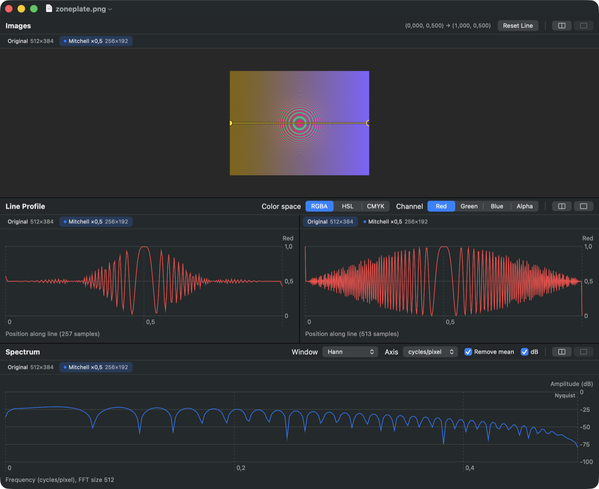

# LineScope

A native macOS tool for **seeing what resampling and filtering do to an image**. You derive copies of an image with different methods and draw one line across them. LineScope then shows, for every copy, side by side:

1. the image at its true pixel scale, with the line on it;
2. one color channel sampled along the line (RGBA, HSL or CMYK);
3. the Fourier transform of that profile, with the Nyquist frequency marked.

The line is shared, so moving it in one copy moves it in all of them. Aliasing, blur and ringing become visible at once.



## Features

- **Resampling**, written from textbook kernels: nearest, tent (bilinear), Catmull-Rom, Mitchell-Netravali, Lanczos-3, truncated sinc, area average.
- **Filters**: Gaussian, box, median, noise reduction, unsharp mask, Sobel, Laplacian, emboss, grayscale, invert. Operations chain: each one applies to the tab in focus and adds a new tab.
- **Test patterns** (File ▸ New Test Pattern): zone plate, chirp, sine and square gratings, checkerboard, step and slanted edges, impulses, Siemens star, white noise, hue ramp.
- **Layout**: every zone can be split to show copies side by side. An inspector window (⌥⌘I) shows sizes, the chain of operations applied, line coordinates and peak frequency.

## Build and run

Requires macOS 15 or later and Xcode 16 or later.

```sh
open LineScope.xcodeproj        # then Run (⌘R)
# or from the command line:
xcodebuild -project LineScope.xcodeproj -scheme LineScope -derivedDataPath build build
open build/Build/Products/Debug/LineScope.app
```

The Xcode project is generated from `project.yml` with [XcodeGen](https://github.com/yonaskolb/XcodeGen). Run `xcodegen generate` after adding or removing source files.

Unit tests for the numeric core:

```sh
cd Packages/LineScopeCore && swift test
```

## Documentation

| Document | What it is |
|---|---|
| [**Theory and code**](Docs/LineScope-Theory-and-Code.md) ([PDF](Docs/LineScope-Theory-and-Code.pdf)) | Sampling and aliasing, resampling kernels and their frequency responses, filters, color models, the DFT and windowing, test patterns, architecture and experiments, all mapped to the code |
| [**Literate program**](LiterateP/linescope.pdf) (PDF, 102 pages) | The whole code base as a Knuth-style literate program. `cd LiterateP && make check` confirms it tangles back to the sources byte for byte ([details](LiterateP/README.md)) |
| [Session summary](Docs/Session-Summary.md) | How the project was built, the decisions made, and the known limitations |

## Layout

```
LineScope/               SwiftUI app: document, session model, views, menus
Packages/LineScopeCore/  numeric core (pixels, resampling, filters, sampling, color, FFT, patterns) and tests
LineScope.xcodeproj      generated from project.yml
LiterateP/               literate program (noweb chapters, lit.py, LaTeX driver, PDF)
Docs/                    theory document, figures, PDFs, session summary
```
